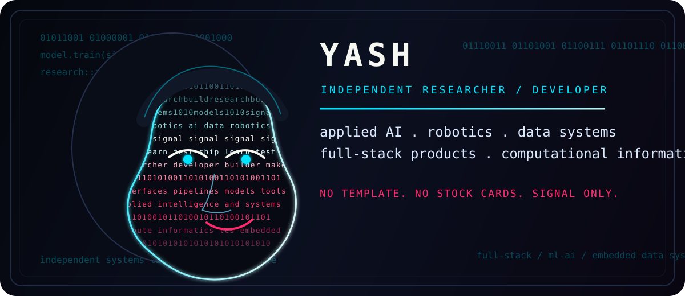

<!--
  Yash Thakur profile README
  Design source: custom repo-hosted SVG + Markdown dossier.
  No generated banner, stats-card theme, or copied README template is used.
-->

<div align="center">



<br />

<a href="mailto:yasht2008@gmail.com">email</a> / <a href="https://github.com/yashthakur2008">github</a> / <a href="https://www.linkedin.com/in/yash-thakur-2a8977198/">linkedin</a>

</div>

---

## live signal

```text
identity    independent researcher + developer
mode        build, test, ship, research, repeat
focus       applied AI, robotics, data systems, full-stack products
current     CTO @ Stealth / ex-Drivetrain / startup-heavy builder
research    SJSU + independent interdisciplinary research
fields      applied AI, robotics, computational informatics, TCS, data/embedded systems
```

I build at the intersection of research and product. I care about systems that are technically serious but still usable: tools that turn messy signals into structured workflows, products that feel fast and intentional, and research ideas that can survive contact with implementation.

This profile is intentionally not a stock GitHub README layout. The visual language is a custom repo-hosted SVG: a portrait-like signal panel built from code-rain texture, contour lines, and research/developer typography. It is local to this repository, not a banner generator or copied template.

---

## selected work

<table>
<tr>
<td width="50%">

### AEGIS

Autonomous Epidermal and Germicidal Imaging System.

A robotics and imaging system concept at the edge of medical sensing, automation, and intelligent intervention.

<a href="https://github.com/yashthakur2008/AEGIS">repository</a>

</td>
<td width="50%">

### orama

AI-assisted research paper summarization.

A tool for compressing dense papers into structured, readable outputs that are easier to scan, compare, and reuse.

<a href="https://github.com/yashthakur2008/orama">repository</a>

</td>
</tr>
<tr>
<td width="50%">

### ditto

TypeScript application experiment.

A product engineering workspace for interfaces, reusable web logic, and fast iteration.

<a href="https://github.com/yashthakur2008/ditto">repository</a>

</td>
<td width="50%">

### refrain

Creative systems experiment.

A software space for rhythm, repetition, interface behavior, and expressive tooling.

<a href="https://github.com/yashthakur2008/refrain">repository</a>

</td>
</tr>
</table>

---

## build surface

```text
languages      Python / TypeScript / JavaScript / Java / SQL / Go
product        React / Next.js / Node.js / Tailwind
systems        Docker / AWS / PostgreSQL / Git
data           Pandas / NumPy / dbt / Spark / BigQuery / Snowflake
intelligence   PyTorch / TensorFlow / scikit-learn / Hugging Face
```

I like work that combines:

```text
- independent research taste
- developer execution speed
- strong product instincts
- original visual direction
- systems that feel useful, not decorative
```

---

## contact hub

```text
email       yasht2008@gmail.com
github      https://github.com/yashthakur2008
linkedin    https://www.linkedin.com/in/yash-thakur-2a8977198/
```

<div align="center">

<pre>
END TRANSMISSION / STILL BUILDING
</pre>

</div>
